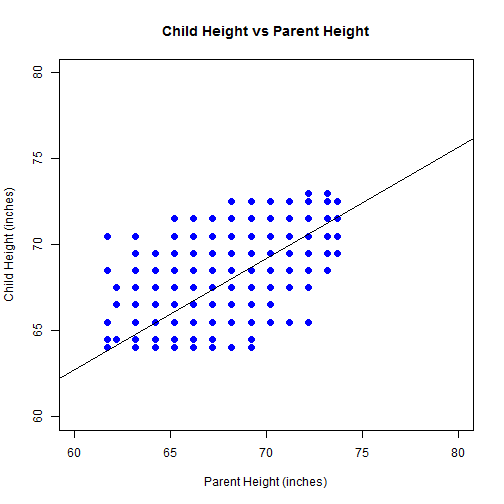
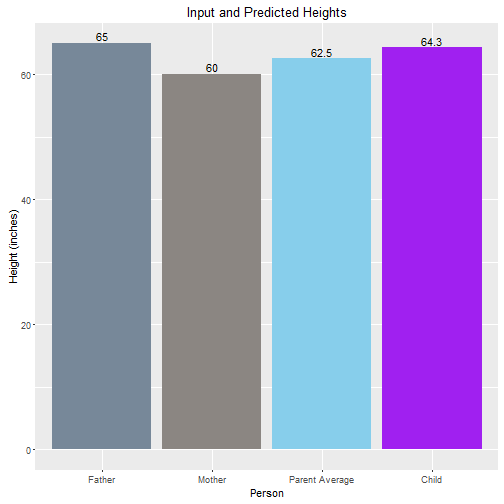

<style>
.small-code pre code {
  font-size: 1em;
}
</style>


Shiny Galton Predictor
========================================================
author: Alex Ng
date: 17 Sep 2016
font-family: 'Helvetica'

<div class="midcenter" style="margin-left:650px; margin-top:-130px;">
</img>
</div> 

Introduction
========================================================
The Shiny Galton Predictor is a Shiny Web Application that
allows the user to predict an adult child's height based on the 
height of the child's parents.
- User inputs the heights of both parents
- Using linear regression, the application will predict the height of the children

The application can be accessed at: https://maestro.shinyapps.io/Shiny_Galton_Predictor/
<div class="midcenter" style="margin-left:300px; margin-top:-30px;">
</img>
</div>

Galton Data Set
========================================================
class: small-code
The Galton dataset is used for building the regression model where:
- "parent" = average parent height
- "child" = child height. 
Units are in inches. 

```
'data.frame':	928 obs. of  2 variables:
 $ parent: num  70.5 68.5 65.5 64.5 64 67.5 67.5 67.5 66.5 66.5 ...
 $ child : num  61.7 61.7 61.7 61.7 61.7 62.2 62.2 62.2 62.2 62.2 ...
```
***

Above is the plot of the dataset data points (blue) and fitted regression line.


Application Features I
========================================================
- User inputs the heights of the parents using sliders
<div class="midcenter" style="margin-left:0px; margin-top:0px;">
</img>
</div>
- The application will present the results of the prediction
<div class="midcenter" style="margin-left:0px; margin-top:0px;">
</img>
</div>


Application Features II
========================================================
The prediction data point (red) is plotted on the model's dataset.

***
The predicted adult child's height is plotted against the inputs.


